# 基于FPGA的DES加解密IP核

## 一、原理解释

DES（Data Encryption Standard）是一种对称密钥加密算法，其主要特点包括：

1. **加密/解密对称性**：使用相同密钥完成加密和解密操作。
2. **64位数据块处理**：每次处理64位明文或密文。
3. **16轮Feistel结构**：每轮对数据进行分组替换和置换操作。
4. **密钥调度**：从64位主密钥生成16轮48位子密钥。
5. **核心运算**：包括S盒替换、P置换、异或运算以及左右交换。

### 1. 数据块和初始置换（IP）

- 输入明文为64位，输出密文也为64位。
- 首先对明文进行初始置换（Initial Permutation, IP），将64位明文重新排列，这一步的作用是打乱原始数据位序，增加算法的扩散性。
  
  公式表示：$$IP(M)=M'[1..64],M'=permutation(M)$$
  
  其中：$M$为原始明文，$M'$为置换后数据。

### 2. Feistel结构（16轮迭代）

- DES使用**16轮Feistel结构**对数据块进行处理：
  1. 将初始置换后的数据分为左右两部分：$$L0​=IP(M)[63:32],R0​=IP(M)[31:0]$$
  2. 每一轮进行一次计算，共计算16轮：$$Li​=Ri−1​,Ri​=Li−1​⊕F(Ri−1​,Ki​)$$
  
  其中：$Ki$为第$i$轮的密钥，由密钥调度产生。F 函数为DES核心函数，包含扩展、异或、S盒替换和P置换。

### 3. 逆初始置换（IP⁻¹）

- 将16轮输出进行逆初始置换，得到最终64位密文$C$：$$C=IP−1(R16​∣∣L16​)$$

### 4. 密钥调度

- 主密钥为64位，其中8位为奇偶校验位（可以直接忽略），实际有效密钥为56位。
- 通过 PC1置换，将56位密钥分为左右两部分$C0，D0$(各28位)。
- 每轮根据左移轮数生成$Ci，Di$，再通过PC2置换得到48位的子密钥$Ki$。
- 解密时，子密钥顺序反转使用$K16，K15，...，K1$，即可完成解密。

## 二、设计思路（包含设计过程和设计方案）

### 1. C语言建模仿真

- **目标**：在软件环境下实现DES加解密算法，验证功能正确性。
- **内容**：
  - 使用C/C++实现DES算法核心，包括初始置换、16轮轮函数（F函数）、S盒替换、P置换、左右半交换等。
  - 实现密钥调度算法，生成16轮子密钥。
  - 完成功能仿真，对比标准测试向量，确保加密和解密结果正确。
- **意义**：
  - 提前验证算法逻辑，减少FPGA RTL实现调试难度。
  - 为后续RTL设计提供参考数据。
    
    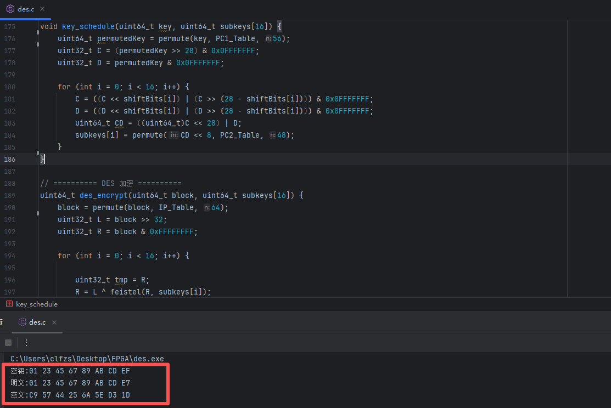

### 2、FPGA总体架构设计

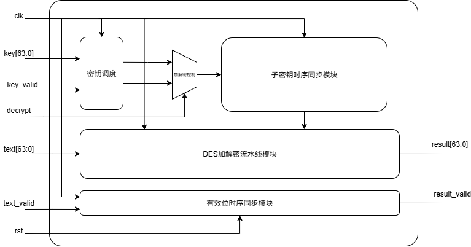

- **输入信号**
  |信号名|类型|说明|
  |--|--|--|
  |`clk`|时钟|系统主时钟|
  |`rst`|复位|异步复位信号，低电平有效|
  |`key[63:0]`|输入|64位原始密钥（含8位奇偶校验位）|
  |`key_valid`|控制|密钥有效标志，表示当前密钥有效|
  |`text[63:0]`|输入|64位明文或密文数据|
  |`text_valid`|控制|数据有效标志|
  |`decrypt`|控制|选择模式：`1`为解密，`0`为加密|
- **输出信号**
  |信号名|类型|说明|
  |--|--|--|
  |`result[63:0]`|输出|加解密后的结果（密文或明文）|
  |`result_valid`|控制|结果有效标志|
- **核心模块功能分析**
  - 1.密钥调度模块
    - **功能**：将64位原始密钥进行处理，提取出56位有效密钥，并进行**PC-1置换、循环左移、PC-2置换**。
    - **输出**：生成16轮所需的子密钥（每轮48位），同时给到加解密控制模块。
    - **依赖信号**：`key[63:0]`和 `key_valid`触发密钥初始化，当`key_valid`为有效时会将`key`进行处理。
  - 2.加解密控制模块
    - **功能**：将16轮密钥进行处理，对密钥进行排序，实现选择**加密**或**解密**的功能。
    - **输出**：传递**正序加密密钥**或**逆序解密密钥**，给到子密钥时序同步模块。
    - **依赖信号**：`decrypt`选择加解密模式和上级模块产生的16轮子密钥。
  - 3.子密钥时序同步模块
    - **功能**：管理每轮子密钥的时序，确保每轮Feistel函数获得同时序的密钥，以达到**密钥和数据同步**，实现**密钥也可以实时输入**。
    - **输出**：每周期提供一个48位子密钥给DES流水线模块。
    - **依赖信号**：`clk`时钟同步信号和上级模块传递的16轮子密钥。
  - 4.DES加解密流水线模块
    - **功能**：实现DES的**核心算法**逻辑——Feistel结构，共16轮迭代。
    - **输出**：DES对数据处理后的结果（密文或明文）`result[63:0]`。
    - **依赖信号**：待处理数据`text[63:0]`、时钟同步信号`clk`和来自上级模块的子密钥。
  - 5.有效位时序同步模块
    - **功能**：向后传递数据有效位，确保有效位和处理后数据同时到达`result`输出，当**复位信号**有效时，将所有周期有效位清零。
    - **输出**：和数据时序同步的有效位，为`1`代表该周期输出的数据是处理后的数据。
    - **依赖信号**：`clk`时钟同步信号，复位信号`rst`和输入的数据有效信号`text_valid`。

### 3、数据流与控制流路径

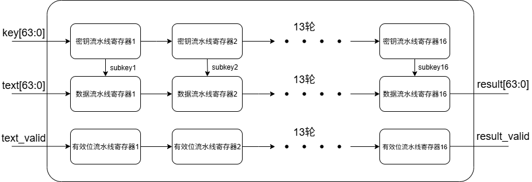

- **密钥数据流路径（创新点）**：
  - 实现子密钥的定时供应。
  - 实现密钥和数据可以每周期同步输入。
  - 确保第 `i` 轮运算使用正确的 `subkey_i`。
- **数据流路径**
  - 逐级完成DES的16轮Feistel迭代运算，实现64位数据的加密或解密。
  - 每轮Feistel运算：处理右半区，与子密钥异或，经S盒和P盒变换，再与左半区异或并交换。
  - 全程与密钥流、有效位流同步，支持每周期处理一个数据块。
- **有效位数据流路径**
  - 标记数据包的有效性，并在结果就绪时发出握手信号。
  - 避免因异步读取导致的数据错误。
  - 实现模块复位功能，复位有效时，将该路径所有寄存器清零。
  - 该路径存在可以简化复位线路复杂性，提高全模块的处理速度。

### 4、代码设计（示例）

- **IP置换、IP⁻¹置换、E置换、PC1置换、PC2置换**
  - 示例代码（IP置换）：
    ```verilog
    assign result = {
        text[64-58], text[64-50], text[64-42], ... text[64-2],
        text[64-60], text[64-52], text[64-44], ... text[64-4],
        text[64-62], text[64-54], text[64-46], ... text[64-6],
        text[64-64], text[64-56], text[64-48], ... text[64-8],
        text[64-57], text[64-49], text[64-41], ...  text[64-1],
        text[64-59], text[64-51], text[64-43], ... text[64-3],
        text[64-61], text[64-53], text[64-45], ... text[64-5],
        text[64-63], text[64-55], text[64-47], ... text[64-7]
    };
    ```
  - 采用总线直接交换的形式，不经过寄存器，速度最快。
- **Feistel核心，Sbox变换**
  - 示例代码：
  ```verilog
  module des_S #(
      parameter SBOX_ID = 0
  )(
      input clk,
      input [1:0] row_in,
      input [3:0] col_in,
      output reg [3:0] out
  );
  
  reg [1:0] row;
  reg [3:0] col;
  
   always @(posedge clk) begin
      row <= row_in;
      col <= col_in;
   end
      always @(*) begin
        case (SBOX_ID)
          0:
          case (row)
              0:case (col)
                0:out=14; 1:out=4; 2:out=13; ... 15:out=7;
                endcase
              1:case (col)
                0:out=0; 1:out=15; 2:out=7; ... 15:out=8;
                endcase
              2:case (col)
                0:out=4; 1:out=1; 2:out=14; ... 15:out=0;
                endcase
              3:case (col)
                0:out=15; 1:out=12; 2:out=8; ... 15:out=13;
                endcase
          endcase
        //省略剩下15轮......
          default: out = 0;
        endcase
      end
  ```

## 三、电路时序分析

### 1. 支持最高频率

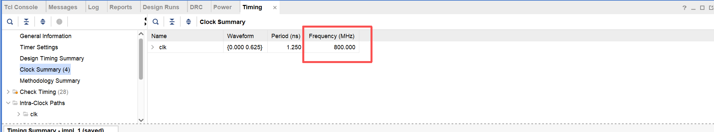

- 可跑**800MHz**（测试板上限，理论最高近1GHz），每**1.25ns**可以处理一轮64位的数据。

### 2. 路径裕量

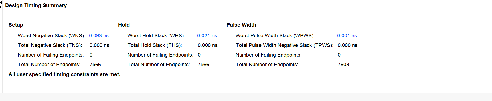

- 在800MHz的频率下，最慢路径建立时间裕量**0.093ns**，最快路径保持时间裕量**0.021ns**，最坏路径脉冲宽度裕量**0.001ns**。
- 因为脉冲宽度裕量和开发板硬件相关，所以限制了该开发板最高频率800MHz。

### 3. 输出周期

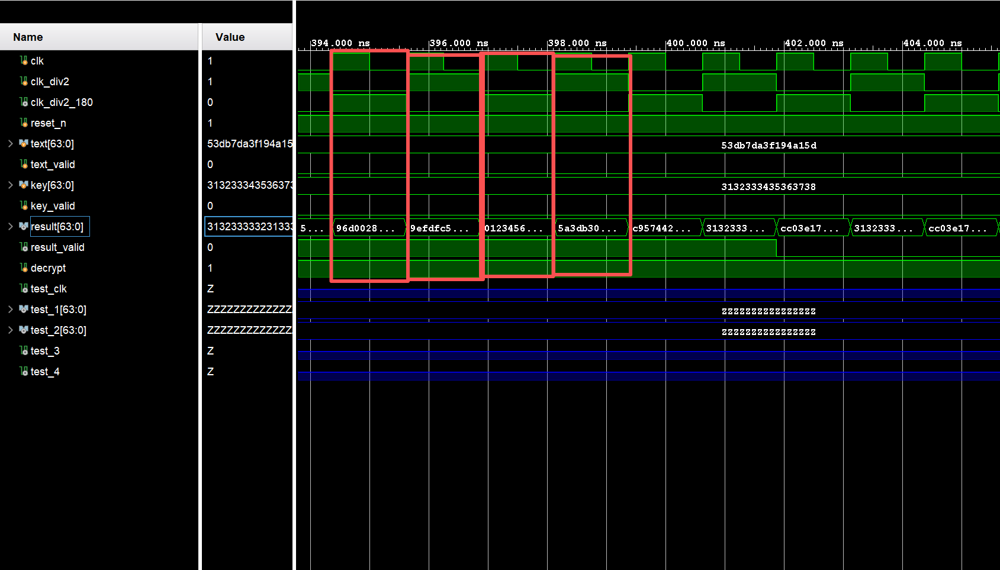

- `result[63:0]`是IP核的输出结果，可以从图中看出，时钟每一拍都可以输出一轮数据。
- 在该开发板上时钟最高可跑800MHz，也就是1.25ns一轮数据。

## 四、电路功耗分析

### 1. IP核总体功耗

- 工作条件电压 1.0V，温度 25℃，时钟频率 800MHz下，总体功耗约为 1268mW。
- 该功耗包含动态功耗、静态功耗等部分，其中动态功耗占比较大，是影响总体功耗的主要因素。

### 2. 动态功耗

- 动态功耗主要来源于电路中晶体管的开关活动，与信号翻转频率、负载电容以及供电电压有关。
- 在 800MHz 时钟频率下，IP 核的动态功耗约为 1194mW。其中，DES 加解密流水线模块是动态功耗的主要消耗者，由于该模块包含 16 轮 Feistel 结构的迭代运算，涉及大量的异或、置换、S 盒替换等操作，信号翻转频繁，导致其动态功耗占比超过 60%；密钥调度模块因需要进行多次置换和移位操作，动态功耗占比约 20%；其他辅助模块的动态功耗占比约 20%。
  
  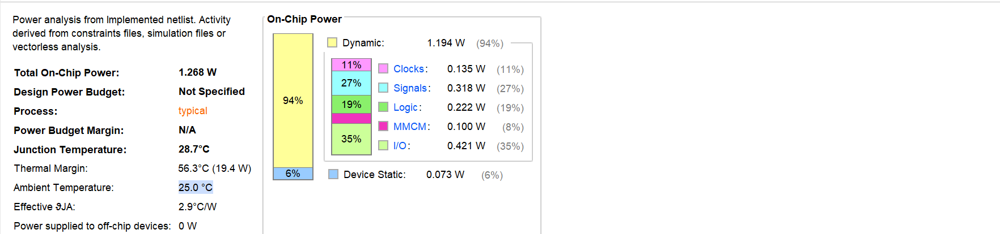

### 3. 静态功耗

- 静态功耗主要由晶体管的泄漏电流引起，与温度和工艺参数关系较大。在 25℃环境下，IP 核的静态功耗约为 73mW。随着温度的升高，泄漏电流增大，静态功耗会有所上升。

### 4. IP核资源分析

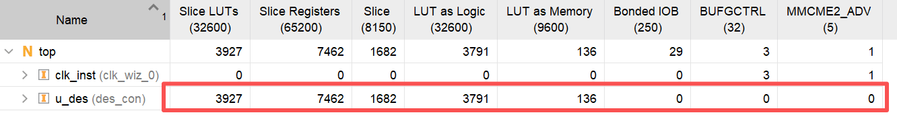

- 查找表（LUT）：3927 个，主要用于实现 S 盒、各种置换逻辑以及组合逻辑运算。
- 触发器（REG）：约 7462个，主要用于流水线寄存器、数据和密钥的暂存以及控制信号的同步。

<br/>

## 五、仿真测试

### 1. IP核仿真思路

- 测试激励文件编写：为整个仿真流程提供输入信号（如密钥、明文、时钟、复位、有效标志等）的驱动逻辑。
- S 盒测试：DES 的 8 个 S 盒是算法非线性性的核心，需逐一验证 “6 位输入→4 位输出” 的映射是否与 DES 标准表完全一致。
- P 盒测试：验证 32 位数据的位重排逻辑，确保置换后的位序符合 DES 算法定义。
- 初始置换 IP / 逆初始置换 IP⁻¹ 测试：分别验证 64 位明文的初始位重排和 64 位密文的逆位重排是否正确是 DES 加解密流程的首尾环节”。
- 密钥置换盒 PC-1/PC-2 测试：覆盖 “64 位密钥→56 位有效密钥→16 轮子密钥” 的全流程，验证密钥调度的每一步位操作是否符合规范。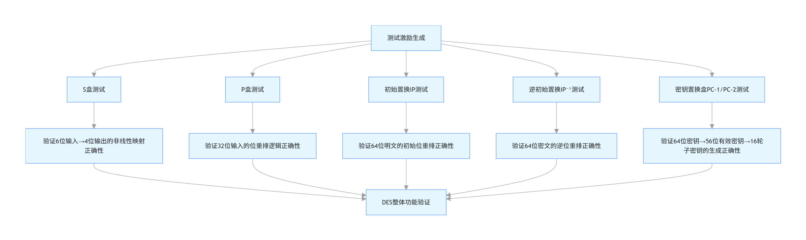

### 2. IP核仿真结果

- 密钥调度模块：生成的 16 轮子密钥与标准测试向量完全一致，验证了密钥处理过程的正确性。
- DES 加解密流水线模块：单独仿真时，每轮 Feistel 运算的中间结果符合理论预期，确保了核心算法逻辑的正确性。
- 整体仿真：选取多组标准明文和密钥进行测试，加密得到的密文与预期结果一致，将密文解密后能准确恢复出原始明文，且数据有效信号和结果有效信号的时序同步，无错位现象。
- 密钥输入（`key[63:0]`）：初始输入为十六进制字符串0123456789abcdef，后续出现3132333435363738、1334577...等数据，key_valid信号为 1 表示这些密钥数据有效。
- 明文输入（`text[63:0]`）：初始输入为十六进制字符串0123456789abcdef，后续出现31323333...、00000000...、e957442...、ffffffff...等多组数据，text_valid信号为 1 表示这些明文数据有效。
  
  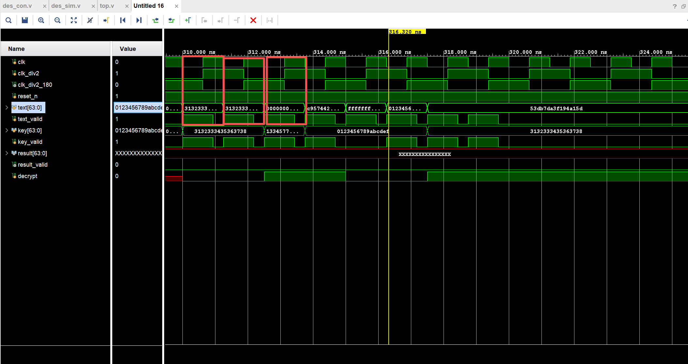
- 从该仿真波形图中，DES 模块在加密模式下明文0123456789abcdef、密钥3132333435363738输出的密文为 **53DB7DA3F194A15D**（十六进制，64 位）结果正确。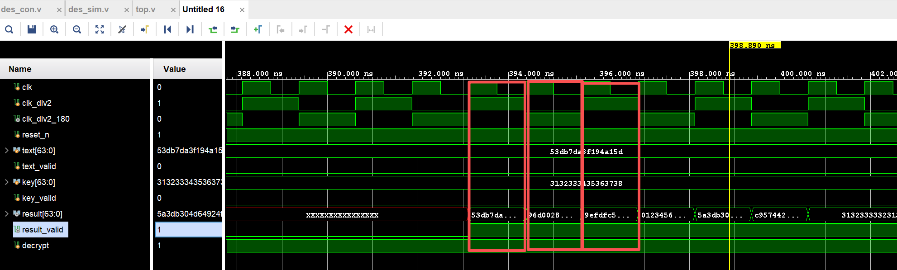
  
  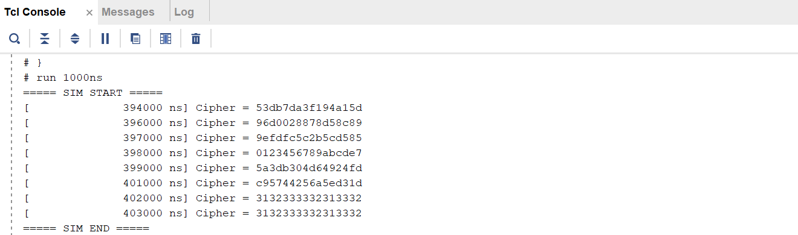
- 复位信号（reset_n）：当前为 0，处于复位状态，text[63:0]、key[63:0]虽有数据值，但输出结果仍会正常清零。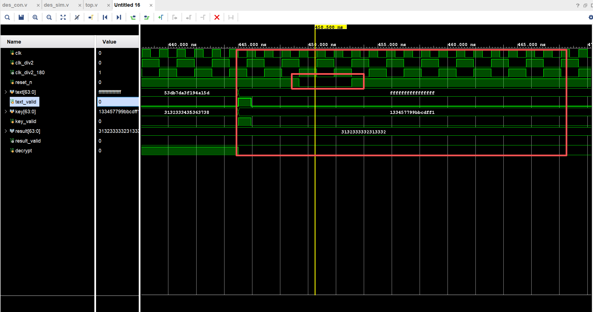

### 3. IP核仿真代码（示例）

```verilog
task send_key_text;
  input [63:0] key_in;
  input [63:0] text_in;
  input decrypt_in;
begin
  @(negedge clk);
  key        <= key_in;
  text       <= text_in;
  key_valid  <= 1;
  text_valid <= 1;
  decrypt <= decrypt_in;
  //        @(posedge clk);
  #0.9375;
  key_valid  <= 0;
  text_valid <= 0;
end
endtask

send_key_text(64'h3132333435363738,
              64'h3132333332313332,0);

send_key_text(64'h3132333435363738,
              64'h3132333435363738,0);
send_key_text(64'h133457799BBCDFF1,
              64'h0000000000000000,1);
send_key_text(64'h0123456789abcdef,
              64'hc95744256a5ed31d,1);
send_key_text(64'h0123456789abcdef,
              64'h0123456789abcde7,0);
send_key_text(64'h3132333435363738,
              64'h53db7da3f194a15d,1);
send_key_text(64'h3132333435363738,
              64'h53db7da3f194a15d,1);             
```

### 4. 串口仿真思路

- 通过搭建串口通信仿真模型，模拟上位机与 FPGA 之间的串口数据传输。将 IP 核的加解密结果通过串口发送模块发送，同时接收上位机发送的明文或密文数据，验证串口数据传输的正确性以及 IP 核与串口模块接口的兼容性。仿真重点关注波特率匹配、数据帧格式（起始位、数据位、校验位、停止位）以及数据传输的完整性。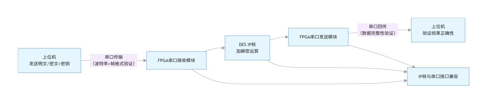

### 5. 串口仿真结果

- 串口仿真中，设置波特率为 9600bps，数据格式为 8 位数据位、1 位停止位、无校验位。上位机发送的明文数据经 FPGA 接收后，通过 IP 核加密处理，再由串口发送回上位机，上位机接收到的密文与预期一致；同样，上位机发送的密文经 FPGA 接收解密后，发送回上位机的明文准确无误。数据传输过程中无丢包、错包现象，验证了串口通信的可靠性。
  
  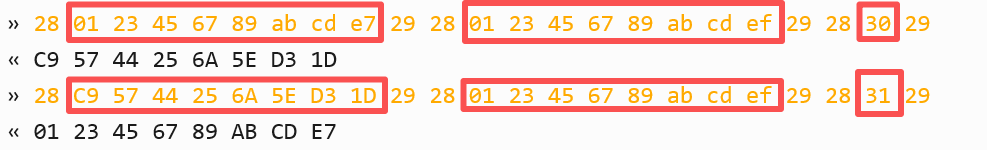

### 6. 串口仿真代码（示例）

```verilog
task send_key_text;
  input [63:0] key_in;
  input [63:0] text_in;
  input decrypt_in;
begin
  @(negedge clk);
  key        <= key_in;
  text       <= text_in;
  key_valid  <= 1;
  text_valid <= 1;
  decrypt <= decrypt_in;
  //        @(posedge clk);
  #0.9375;
  key_valid  <= 0;
  text_valid <= 0;
end
endtask

send_key_text(64'h3132333435363738,
              64'h3132333332313332,0);
        
send_key_text(64'h3132333435363738,
              64'h3132333435363738,0);
send_key_text(64'h133457799BBCDFF1,
              64'h0000000000000000,1);
send_key_text(64'h0123456789abcdef,
              64'hc95744256a5ed31d,1);
send_key_text(64'h0123456789abcdef,
              64'h0123456789abcde7,0);
send_key_text(64'h3132333435363738,
              64'h53db7da3f194a15d,1);
send_key_text(64'h3132333435363738,
              64'h53db7da3f194a15d,1);      
```

## 六、板级验证

### 1. 板级验证思路

- 采用纯串口通信架构，简化外设依赖。
- UART 串口模块（波特率 9600bps，无奇偶校验，1 位停止位）：
接收上位机发送的控制指令（加密 / 解密模式切换）、64 位密钥（ASCII 十六进制格式）、64 位明文 / 密文数据，处理后向上位机回传加解密结果。
- 系统时钟：50MHz 晶振输入，经 PLL 倍频至 800MHz 供给 IP 核，测试IP核高频状态。
- 复位按键：提供硬件复位功能，恢复初始状态。

### 2. 板级验证结果（图片）

- 按赛题ppt给出数据测试，明文：0123456789abcde7，种子密钥：0123456789abcdef，密文：c95744256a5ed31d。
- 输出结果和赛题ppt完全一致，结果正确，板级验证通过。
- 复位功能测试，长按无输出，复位功能正常。

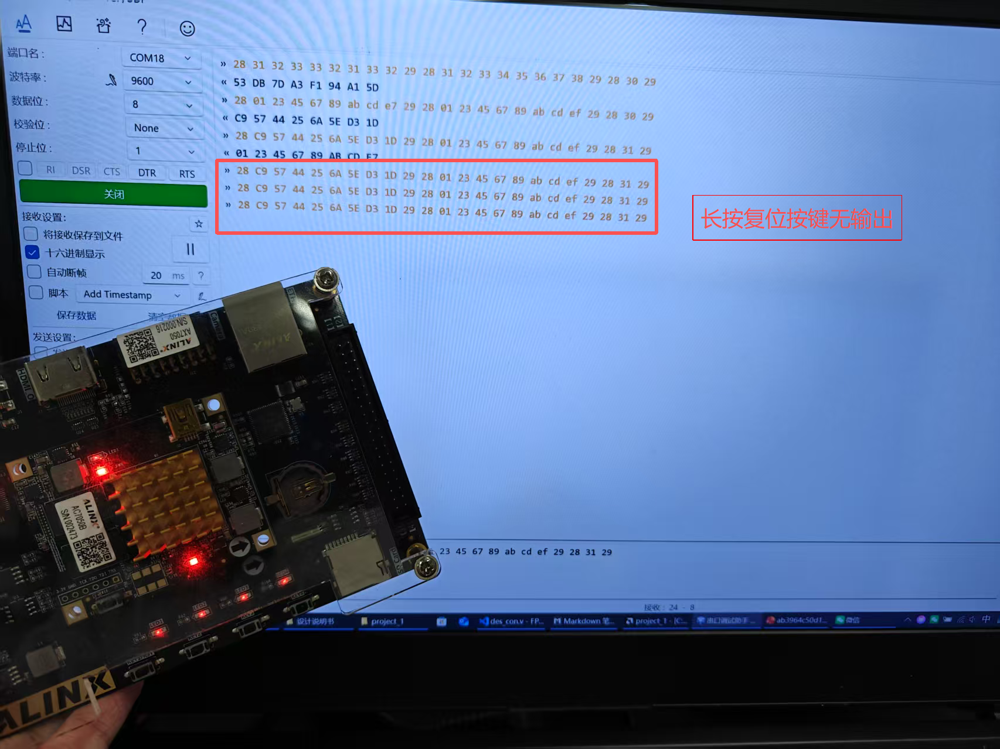

### 3. 板级验证代码（示例）

```verilog
`timescale 1ns / 1ps
module sys_top(
input				sys_clk		,
input				sys_rst_n	,

input				uart_rxd	,
output				uart_txd	
    );
	
//......省略寄存器声明
    
    clk_wiz_0 clk_inst (
        .clk_in1    (sys_clk),     // 输入：外部 50MHz 晶振
        .clk_out1   (clk_div2),    // 输出：400 MHz
        .clk_out2   (clk_div2_180),//400 MHz相位180°
        .clk_out3   (clk),         //50MHz
        .clk_out4   (clk_hight)    //800MHz
    );
//......省略部分过程保留关键状态机思路代码
	
	always@(posedge clk or negedge sys_rst_n)
		if(!sys_rst_n)begin
			uart_tx_en	<= 1'b0	;
			send_cnt 	<= 8'd0	;
			uart_data	<= 8'd0	;
		end
		else case(send_cnt)
			8'd0:if(down_reg0)begin
				uart_data	<= result[63 -: 8]	;
				uart_tx_en	<= 1'd1		;
				send_cnt	<= send_cnt + 8'd1	;
			end
			else begin
				uart_data	<= uart_data	;
				uart_tx_en	<= 1'd0			;
				send_cnt	<= send_cnt 	;
			end
			8'd1,8'd2,8'd3,8'd4,8'd5,8'd6:if(tx_down_reg)begin
				uart_data	<= result[((8-send_cnt)*8-1)-:8]	;
				uart_tx_en	<= 1'd1		;
				send_cnt	<= send_cnt + 8'd1	;
			end
			else begin
				uart_data	<= uart_data	;
				uart_tx_en	<= 1'd0			;
				send_cnt	<= send_cnt 	;
			end
			8'd7:if(tx_down_reg)begin
				uart_data	<= result[7 : 0]	;
				uart_tx_en	<= 1'd1		;
				send_cnt	<= 8'd0		;
			end
			else begin
				uart_data	<= uart_data	;
				uart_tx_en	<= 1'd0			;
				send_cnt	<= send_cnt 	;
			end	
			default :begin
				uart_tx_en	<= 1'b0	;
				send_cnt 	<= 8'd0	;
				uart_data	<= 8'd0	;
			end
			endcase 
	
	assign result = result_reg;
	always @(posedge clk) begin
		text_valid_reg <= down;
	end
	always @(posedge clk_hight) begin
        if(valid)begin
            result_reg <= result_wire;
            valid_reg <= 1'd1;
        end else if(valid_updata)begin
            valid_reg <= 1'd0;
        end
     end
	
	des_0 inst_des(
	  .clk          (clk_hight           ), 
	  .clk_div2     (clk_div2            ),
    .clk_div2_180 (clk_div2_180        ),
		.rst          (sys_rst_n           ),
		.text		    	(text   	           ),    // input wire [63 : 0] text
		.key			    (key		             ),    // input wire [63 : 0] key
		.key_valid		(1'b1		             ),
		.text_valid		(text_valid_reg	     ),
		.decrypt	  	(decrypt	           ),    // input wire decrypt
		.result		  	(result_wire         ),    // output wire [63 : 0] result
		.result_valid	(valid               )
);
endmodule

```
